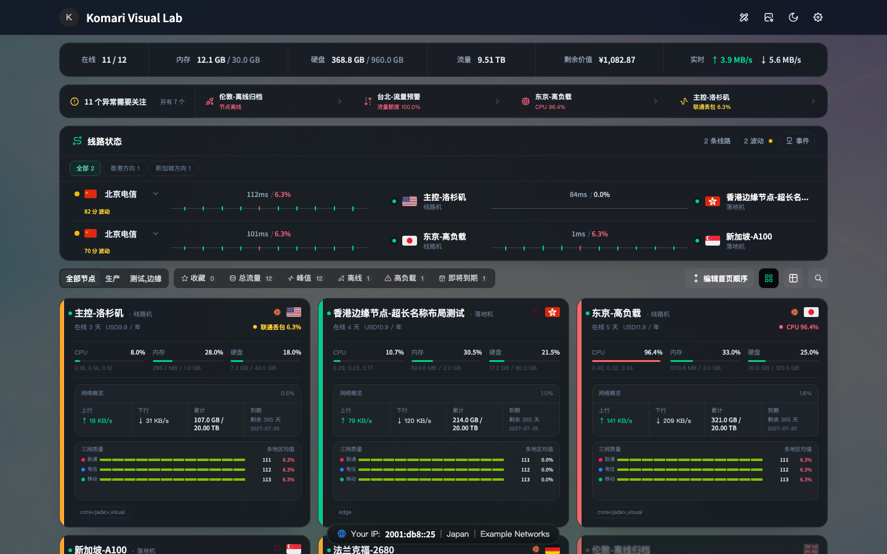
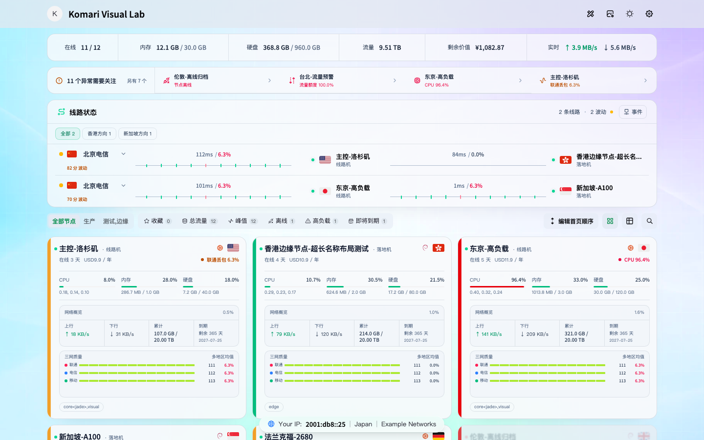
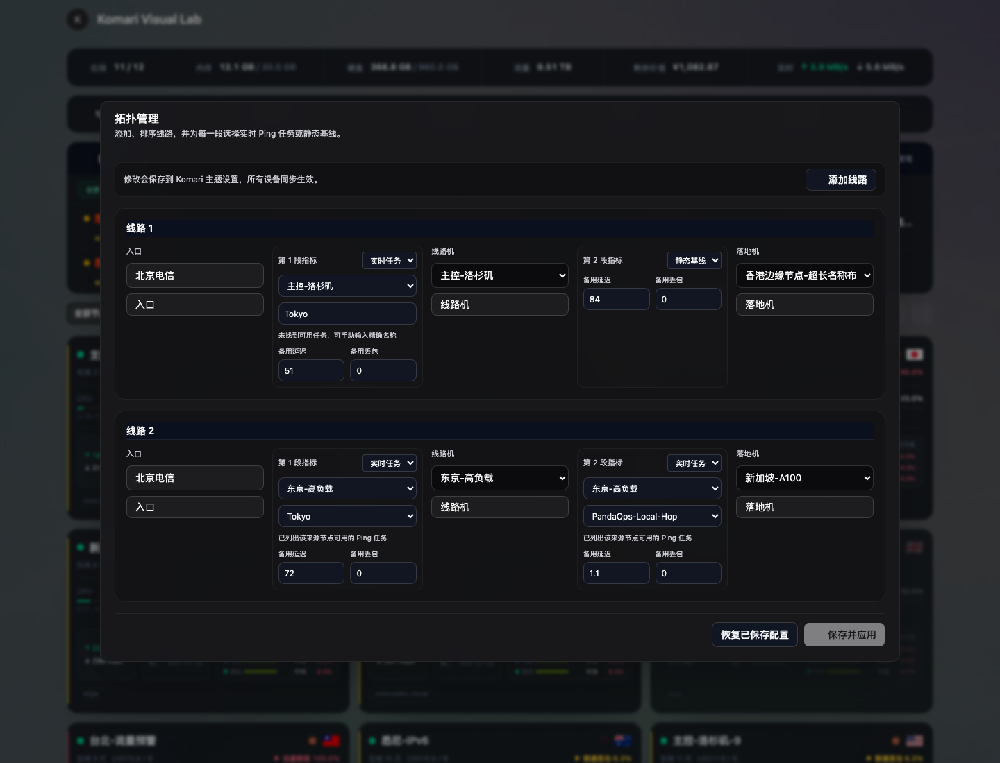

# Transit for Komari

> A topology-first network operations theme for Komari.

[](https://github.com/yyy622hhh/komari-theme-transit/releases)
[](https://github.com/yyy622hhh/komari-theme-transit/actions/workflows/quality.yml)
[](https://github.com/yyy622hhh/komari-theme-transit/actions/workflows/visual-regression.yml)
[](https://github.com/yyy622hhh/komari-theme-transit/actions/workflows/browser-functional.yml)
[](https://github.com/yyy622hhh/komari-theme-transit/actions/workflows/komari-compat.yml)
[](LICENSE)
[](https://vuejs.org/)

Transit 是一个面向多节点、多线路和跨境链路监控的 Komari 社区主题。它把“入口 → 线路机 → 落地机”的链路拓扑、北京/上海/广州三网 Ping、实时资源、异常告警和资产信息放进同一套紧凑界面，并提供可视化拓扑管理器。

- 当前稳定版：[v1.0.37](https://github.com/yyy622hhh/komari-theme-transit/releases/tag/v1.0.37)
- 安装包：只从 [GitHub Releases](https://github.com/yyy622hhh/komari-theme-transit/releases) 下载 `komari-theme-Transit-build-*.zip`
- 项目定位：社区主题，不修改 Komari 数据库、Agent、系统账户或公开 API



## 文档导航

- [快速开始](#快速开始) · [拓扑管理器](#拓扑管理器) · [三网质量与采样交互](#三网质量与采样交互)
- [节点卡片智能观测面板](#节点卡片智能观测面板) · [主题设置](#主题设置) · [隐私](#隐私)
- [兼容性](#兼容性) · [升级与回滚](#升级与回滚) · [常见问题](#常见问题) · [本地开发](#本地开发)

## 为什么使用 Transit

- **拓扑优先**：一眼看清用户入口、线路机、落地机以及每一段链路的延迟和丢包。
- **可视化配置**：不需要手写配置即可添加、排序和删除线路，选择节点并绑定实时 Ping 任务。
- **指标不串线**：线路、链路段和指标按位置一一对应，空组不会让后续延迟错配到其他线路。
- **精确任务绑定**：拓扑按完整 Ping 任务名称匹配，不会聚合名称相似的备用任务。
- **三网质量**：节点卡片集中展示联通、电信、移动的延迟、丢包和近期采样。
- **智能观测面板**：不同节点可分别显示三网、自定义 Ping、系统、流量、存储、GPU 或精简信息，并支持自动选择。
- **统一采样交互**：鼠标悬停显示时间、延迟与丢包；移动端可点击固定浮窗。
- **运维视角**：提供异常摘要、线路可靠性、维护状态、事件时间线、健康统计和审计日志。
- **资产视角**：同时展示价格、剩余价值、到期日、流量配额和厂商信息。
- **原生服务器列表**：登录后可查看实时服务器清单、筛选与排序，并直接保存首页顺序；其余配置管理仍沿用 Komari 自带后台。
- **本机壁纸**：可在顶部上传当前浏览器专用的 JPG、PNG、WebP 或 AVIF 壁纸，并切换玻璃化、模糊和高清效果。
- **隐私默认关闭**：公网信息查询和 Transit 访客审计均为明确选择加入，默认不会触发。

## 功能一览

| 区域     | 能力                                                                           |
| -------- | ------------------------------------------------------------------------------ |
| 线路状态 | 多线路拓扑、入口探测点切换、逐段实时/静态指标、采样浮窗、历史详情、健康评分    |
| 拓扑管理 | 选入口、线路机和落地机后添加或修改，立即保存并自动创建或复用 ICMP/TCP 探测任务 |
| 节点卡片 | CPU、内存、硬盘、上下行、累计流量、到期、价格和按节点配置的智能观测面板        |
| 告警     | 离线、高负载、流量预警、即将到期、Ping 丢包、维护状态和异常时间线              |
| 首页工具 | 服务器列表、节点对比、厂商性价比、健康摘要、快照导出、网络信息和核心审计日志   |
| 节点详情 | 自定义概览卡、完整负载图、Ping 延迟/丢包历史、GPU 与磁盘耗尽预测               |
| 显示     | 亮色/暗色/北京时间自动模式、本机壁纸与三种效果、四档卡片密度和移动端布局       |

## 界面预览

| 暗色总览                                                        | 亮色总览                                                         |
| --------------------------------------------------------------- | ---------------------------------------------------------------- |
|  |  |

### 可视化拓扑管理器

登录后点击“线路状态”右上角的“管理”，选入口、线路机和落地机即可添加线路。添加会立即保存到 Komari 托管主题设置，并同步到所有设备。



## 快速开始

1. 前往 [Releases](https://github.com/yyy622hhh/komari-theme-transit/releases) 下载最新的 `komari-theme-Transit-build-*.zip`。
2. 登录 Komari 管理后台，在主题管理中上传这个 zip；不要上传 GitHub 自动生成的源码压缩包。
3. 启用短名称为 `Transit` 的主题。
4. 打开主题设置，选择主题模式、节点卡密度、默认观测面板和三网地区。
5. 新安装不会预置任何真实节点；返回首页，按“还没有配置线路”的引导添加第一条线路。

升级已有 `Transit` 时，Komari 会继续使用同一短名称下保存的托管主题设置。建议升级前保留上一版 Release，并在更新后强制刷新浏览器。

发布 zip 的根目录固定为：

```text
komari-theme.json
preview.png
dist/
```

Transit 使用独立短名称 `Transit`，不会覆盖已有的 PandaOps、Glassmorphism 或其他主题目录。

## 拓扑管理器

### 使用前准备

配置一条线路只需要三件事：入口、线路机、落地机。

入口是线路图上的标签，例如北京电信、北京联通。如果线路机上已经有同名三网 Ping 任务，第 1 段会直接复用，不管这个任务实际测的是哪；没有的话 Transit 会自动新建一个 ICMP 任务，命名就是该运营商的惯用名（如“北京电信”），探测目标取自社区常用的三网回程测试工具（[zhanghanyun/backtrace](https://github.com/zhanghanyun/backtrace)）内置的落地地址表。线路机到落地机的第 2 段任务由 Transit 按节点地址自动复用或创建，命名为 `Transit-线路机-to-落地机`，并且只分配给所选线路机。

### 配置一条线路

```text
入口 → 线路机 → 落地机
```

| 字段   | 说明                                 |
| ------ | ------------------------------------ |
| 入口   | 北京 / 上海 / 广州的电信、联通或移动 |
| 线路机 | 承担中转或入口探测的服务器           |
| 落地机 | 最终出口服务器                       |

登录后打开拓扑管理器，选好三项后点“添加线路”。已有线路直接改三个下拉框即可，都会立即保存：

- 第 1 段优先绑定线路机上已有的入口探测任务；站里已经有同名任务、只是没把这台线路机算进去时，会把线路机加进这个任务的节点列表而不是重复建一个；都没有才会自动新建并绑定。ICMP 的探测目标是该运营商在对应城市的骨干网关（取自社区常用的三网回程测试地址表），ICMP 不通换到 TCP 时改打同运营商同城市的公共 DNS 解析器的 53 端口。这测的是「线路机主动探测该地址」，方向和「该运营商用户访问线路机」相反，界面会明确标注，不会当作正向体验展示。探测不通时如何自动切换和自愈见下方“自动修复探测”一节。
- 第 2 段按线路机 UUID 与落地机 IP 自动复用已有任务；不存在时会立刻创建并绑定。
- 线路机和落地机的 UUID 会随线路一起保存。在 Komari 里给节点改名后，任何浏览器打开首页都能按 UUID 认回来并把线路自动改成新名字，不需要重新选节点。
- 打开管理器时会按当前节点自动校正旧线路；入口显示为北京电信时，不会再继续使用别的第 1 段任务。
- 默认落地机会避开已经配过的线路；添加后自动切到下一台。
- 相同线路机和落地机不会重复添加，只会更新并保存已有线路。
- 实时数据由线路机发出 Ping，图画方向不等于入口网络正向打过来。

> **数据方向必须按采集端理解。** Komari Ping 样本由线路机发出。视觉上把线路画成“北京电信 → JP”并不会自动获得北京电信到 JP 的正向路径。Transit 会在实时采样和线路详情中显示真实的探测来源和任务名称。

### 多线路操作

- 已添加的线路同样只显示入口、线路机和落地机；改这三项、调整顺序或删除都会立即保存。
- 打开管理器时若校正出旧配置问题，也会自动保存。
- “恢复已保存配置”重新载入线上配置并再次校正。
- “保存并应用”只在自动保存被拦住时作为补救。

只有已登录管理员可以保存。公开访客可以查看允许公开的线路状态，但不能修改主题配置。

### 入口探测点切换

每条拓扑线路左侧的入口下拉框支持：

- 北京：电信、联通、移动
- 上海：电信、联通、移动
- 广州：电信、联通、移动

切换后主题会为入口段匹配对应 Ping 任务；线路机上没有匹配任务时会自动新建。广州探测点在任务匹配和创建时都同时接受“广州电信/联通/移动”（显示名）和“广东电信/联通/移动”（惯用任务名）两种命名。

入口切换只覆盖已配置为实时任务的第 1 段，不会把静态基线强制改成实时任务，也不会覆盖自定义入口与自定义任务。临时切换后可选择“恢复原始配置”。

### 自动修复探测（`topologyAutoRepairEnabled`，默认开启）

已登录管理员打开首页时，主题每分钟检查一次入口（第 1 段）和第 2 段（线路机 → 落地机）的探测是否还在出数；拓扑管理对话框打开期间也会用同一套逻辑持续复检。判定为不通时会自动：

1. 换用下一种探测方式。第 2 段（线路机 → 落地机）打的是你自己的机器，阶梯是 ICMP → TCP 443 → TCP 80 → TCP 22；第 1 段（入口）打的是运营商公网测速点，那些地址不接 443/80/22，阶梯只有 ICMP → TCP 53（同运营商同城市的公共 DNS 解析器）；
2. 新建对应的 Ping 任务并写回拓扑绑定——新任务先建好、确认可用后才清理旧的，不依赖旧任务先删除成功。入口段如果站里已经有同名任务、只是没把这台线路机算进去，会改成把线路机加进那个任务的节点列表（这是唯一一处会修改操作者已有任务的地方，只加节点，不改名称、类型和目标）；
3. 尝试清理主题自己建过、且已经用不上的旧任务。所有权记在主题配置里，换标签页或隔天再打开仍然认得出；操作者手建的任务、以及主题只是加了个节点进去的任务永远不碰，清理失败也不影响新任务已经生效。

这是主题里唯一一处**无人值守就会写后端**的逻辑。写入前会校验登录权限、抢跨标签页保存锁并复核服务端快照；保存失败时会回滚本轮新建的任务。如果你希望所有写操作都由人工触发，把这个开关关掉即可——拓扑管理对话框里的手动操作不受影响。

### 数据刷新与降级

- 节点实时状态按主题设置的更新间隔轮询，节点名称、地区等元数据使用独立的低频刷新。
- 元数据请求失败时，主题保留上一份节点信息，并继续应用本轮成功返回的实时状态。
- 实时状态连续失败时会指数退避，最长 60 秒；连接恢复后立即恢复正常间隔。
- Ping 数据超过新鲜度阈值后会标记为已过期，当前指标使用备用基线；过期历史不会继续显示为“实时稳定”。

### 高级文本格式

推荐使用可视化管理器。需要迁移、排障或批量维护时，也可以直接编辑主题设置中的 `topologyRoute` 和 `topologyMetrics`。

线路格式：

```text
节点名称|地区代码|角色;节点名称|地区代码|角色
```

多条线路使用 `||` 分隔：

```text
北京电信|CN|入口;Relay-JP|JP|线路机;Exit-US|US|落地机||上海联通|CN|入口;Relay-SG|SG|线路机;Exit-DE|DE|落地机
```

静态指标格式为 `延迟,丢包`，同一线路的两段使用 `;` 分隔：

```text
51,0;84,0||148,0;1.1,0
```

实时指标格式为：

```text
live@探测来源节点@Ping任务名称@备用延迟@备用丢包
```

`|`、`;`、`||` 和 `@` 是高级文本格式的结构分隔符，不能出现在对应的节点字段或实时任务字段中；可视化管理器会在保存前明确提示并阻止写入，避免线路与指标错位。

完整示例：

```text
live@Relay-JP@北京电信@51@0;live@Relay-JP@Relay-JP-to-Exit-US@84@0||live@Relay-SG@上海联通@72@0;live@Relay-SG@Relay-SG-to-Exit-DE@165@0
```

使用 `-` 表示没有备用值。旧版 `live@节点@地区@运营商@备用延迟@备用丢包` 格式仍可读取。

## 三网质量与采样交互

节点卡片可以显示北京、上海、广东或全部地区的联通、电信、移动质量。每一行同时包含：

- 当前延迟
- 当前丢包率
- 最近一组采样格
- 按延迟、丢包和缺失数据计算的状态颜色

桌面端将鼠标放到采样格上即可查看时间、延迟和丢包；点击可以固定浮窗。移动端直接点击采样格查看，点击空白处关闭。拓扑、节点卡和详情页使用同一套采样交互。

节点卡底部按卡片自身宽度响应，而不是只看浏览器宽度：宽卡片显示速度、累计流量和三网质量三列；中窄卡片让三网质量独占整行；极窄卡片使用单列。节点名最多两行，价格、到期日期、大流量和三网指标不会用省略号隐藏关键数据；未设置到期时也会保留一致的布局高度，不会让同排卡片参差。

## 节点卡片智能观测面板

不是每台服务器都需要固定显示三网质量。Transit 支持按节点 UUID 保存独立观测面板，节点改名后配置仍然有效：

| 模式        | 适合节点               | 展示内容                                     |
| ----------- | ---------------------- | -------------------------------------------- |
| 自动选择    | 不想逐台配置           | 按 GPU、三网任务、流量配额和节点用途自动选择 |
| 三网质量    | 面向大陆用户的节点     | 联通、电信、移动延迟、丢包与近期采样         |
| 自定义 Ping | 中转机、线路机、落地机 | 最多三个该节点真实执行的 Komari Ping 任务    |
| 系统状态    | 普通计算节点           | Load、温度、Swap、进程和连接数               |
| 流量状态    | 限流或大流量节点       | 累计上下行、已用流量、剩余额度和配额比例     |
| 存储状态    | 存储、备份和归档节点   | 已用、可用、总容量与磁盘占用                 |
| GPU 状态    | GPU 计算节点           | GPU 利用率、设备名称和系统温度               |
| 精简信息    | 只需基础状态的节点     | 在线天数、进程数和连接数                     |

全局默认仍是“三网质量”，已有安装升级后不会改变当前卡片内容。管理员可以通过两种方式配置：

1. 点击节点卡或服务器列表中的“运维”按钮，在“节点卡片观测面板”中设置单台节点；选择“自定义 Ping”后，从该节点已配置或已产生样本的任务中选择最多三个。
2. 打开 Transit 服务器列表，点击“批量卡片面板”，将当前分组全部设为同一种模式或恢复跟随全局默认。自定义 Ping 因每台节点的任务不同，仍需逐台选择。

配置通过 Komari 托管主题设置保存，多设备同步。面板只展示 Komari 已上报的数据；任务不存在、未产生样本或记录功能关闭时会明确显示空状态，不会生成模拟数据。所有模式使用相同高度，同一网格行不会因面板类型不同而参差。

## 告警、可靠性与运维工具

Transit 不只展示在线/离线状态，还会把可操作信息集中到首页：

- **异常摘要**：汇总离线、高负载、Ping 丢包、流量预警和即将到期节点。
- **事件时间线**：查看节点异常、恢复和维护事件。
- **线路可靠性**：按有效采样、延迟和丢包计算线路评分，并展示每一段的数据覆盖情况。
- **节点维护**：管理员可以为节点设置维护状态，保存后立即影响告警判断。
- **服务器列表**：按名称、地区、IP、系统和 CPU 搜索，筛选状态，按官方顺序或实时指标升降序排列；管理员可调整首页全局顺序，并按当前分组批量设置卡片面板。
- **节点对比**：比较多个节点的资源、流量、价格和网络数据。
- **健康摘要**：切换日、周、月区间查看历史健康情况。
- **厂商性价比**：按价格、资源和剩余价值排序节点。
- **快照导出**：导出当前监控快照的 CSV 或 JSON。
- **审计日志**：读取 Komari 核心管理员操作日志，不虚构服务端未提供的访客记录；浏览器单次导出最多 5,000 条并标记是否截断，避免大日志库耗尽页面内存。
- **磁盘预测**：样本充足时按历史增长趋势估算磁盘耗尽时间。

高级工具默认只向已登录用户显示，权限校验以 Komari `/api/me` 和服务端接口为准。隐藏按钮、前端状态和本地设置都不是安全边界。

## 主题设置

### 本机壁纸

点击顶部“壁纸与背景效果”按钮即可选择图片。原图保存在当前浏览器的 IndexedDB 中，不会提交给 Komari 或第三方；刷新页面后仍会保留，但其他浏览器、设备和访客不会自动同步。支持 JPG、PNG、WebP、AVIF，单张最大 15 MB、解码后最大 5,000 万像素。

- **玻璃化**：保持壁纸清晰，并加强前景卡片的毛玻璃层次。
- **模糊**：对背景使用 16px 柔焦，降低复杂画面对内容的干扰。
- **高清**：按原图显示，不增加模糊或额外滤镜。

“更换壁纸”只有在新图片完成解码并成功写入浏览器存储后才替换旧图；失败时原壁纸仍会保留。清理站点数据、浏览器无可用存储空间或使用隐私模式时，可能需要重新选择。站点管理员如需给所有访客统一配置背景，仍使用下方的托管 URL/`local:` 背景设置。

Transit 的托管设置按使用路径分为八组：

| 分组                | 主要内容                                                         |
| ------------------- | ---------------------------------------------------------------- |
| 01 · 基础与外观     | 主题模式、刷新间隔、RPC 模式、默认视图、节点卡尺寸与默认观测面板 |
| 02 · 首页布局       | 公告、地球样式、拓扑、三网地区、配色方案、色觉辅助模式           |
| 03 · 首页总览卡片   | 官方/基础/运维/资源/财务等预设与自定义卡片 keys                  |
| 04 · 高级工具与隐私 | 高级工具、访客信息、访客审计、价格隐藏和减少动画                 |
| 05 · 节点卡片与列表 | 快捷筛选、列表字段、离线置底、告警阈值、磁盘预测                 |
| 06 · 节点详情概览   | 分区标签、详情卡片预设与自定义 keys                              |
| 07 · 节点详情图表   | CPU、内存、磁盘、网络、GPU、Ping 等图表组合                      |
| 08 · 自定义背景     | 图片/视频背景、亮暗地址、模糊和遮罩                              |

完整 key、默认值与帮助文本以 [komari-theme.json](komari-theme.json) 为准。Komari 1.2.6 Metric Store 适配细节见 [docs/Komari-1.2.6-theme-adaptation.md](docs/Komari-1.2.6-theme-adaptation.md)。

## 隐私

Transit 将两类可选行为默认关闭：

- **访客公网信息**：开启 `visitorInfoEnabled` 后，访客浏览器会依次请求 `ipwho.is`、`ipapi.co`、`api.ip.sb`，直到一家返回成功。相应服务会看到访客 IP，并返回 IP、地区和运营商信息。
- **访客审计**：只有 `visitorAuditClientEnabled` 与 Komari 核心的 `visitor_audit_enabled` 同时开启时，Transit 才会上报页面事件、设备特征和哈希指纹到站点自己的 Komari。
- **本机壁纸**：壁纸文件只写入访客当前浏览器的 IndexedDB，不经过 Transit、Komari 或第三方网络请求；效果选择只写入同站点 `localStorage`。

公开首页的地球节点只按 Komari 已提供的国家/地区代码定位，不读取节点 IP，也不会为地图向第三方地理服务发送节点 IP。只有已登录用户主动打开需要地理增强的工具时，才可能在权限校验后查询节点 IP。

汇率请求同样按需触发：只有页面实际显示金额时才读取日缓存并在必要时访问汇率服务；隐藏访客价格或当前布局没有金额卡片时不会请求。界面图标已打包进主题，不会请求 Iconify CDN。

部署者在启用前应向访客说明用途、第三方接收方、保留期限和退出方式。完整字段、数据流与运营者检查清单见 [PRIVACY.md](PRIVACY.md)。

## 官方管理后台与授权边界

Transit 不再内嵌或再分发 `komari-web` 构建物。登录后的服务器列表由 Transit 自有代码展示主题已经接收的实时节点数据，并提供排序、首页顺序保存、详情和维护入口；顺序通过 Komari 官方 `admin:orderClients` RPC 保存。新增/删除 Agent、密钥、Ping 任务、通知、主题、插件、数据库、终端、账号和权限等其余配置能力继续使用 Komari 安装包自带的官方后台。主题顶部和服务器列表中的后台入口都直接进入 Komari 1.4.x 的服务器管理路由 `/admin/servers`。

截至本版本发布时，[komari-monitor/komari-web](https://github.com/komari-monitor/komari-web) 没有声明可供第三方修改和再分发的许可证。因此 Transit 的源码仓库和 Release 都不包含它的源码、补丁、构建文件或派生管理端截图。若上游未来提供明确许可，可在符合其条款的前提下重新评估集成。

## 兼容性

| 项目     | 支持范围                                                               |
| -------- | ---------------------------------------------------------------------- |
| Komari   | 隔离实验覆盖 1.2.6、1.4.2、1.4.3；维护者生产环境运行 1.4.2             |
| 浏览器   | Playwright 自动验证 Chromium、Firefox、WebKit 和移动 WebKit            |
| 设备     | 桌面与移动端响应式布局；节点卡最坏情况覆盖 320、390、768、1280、1700px |
| 主题设置 | 同一 `Transit` 短名称升级时保留托管设置                                |
| 服务端   | 主题包不修改 Komari 数据库结构、Agent 或系统账户                       |

Komari 新增接口时，Transit 优先使用 Metric Store；接口不可用时再回退到兼容 records 路径。

## 从 PandaOps 迁移

Transit 与 PandaOps 使用不同短名称，因此两套主题可以并存，但 Komari 不会自动把 PandaOps 的托管设置复制给 Transit。

建议迁移步骤：

1. 记录或导出 PandaOps 当前的 `topologyRoute`、`topologyMetrics` 和自定义设置。
2. 上传并启用 Transit，不要删除 PandaOps。
3. 在 Transit 设置中恢复主题模式、卡片方案和告警阈值。
4. 使用拓扑管理器重新确认入口、线路机和落地机。
5. 验证首页、节点详情和拓扑配置后，再决定是否保留旧主题。

服务器管理员可以在完整数据库备份后复制对应 `theme_configurations`，但不建议普通用户直接修改 Komari 数据库。

## 升级与回滚

升级前建议保存主题设置并保留当前 Release：

1. 下载新的 Release 主题 zip。
2. 在 Komari 主题管理中上传并更新 `Transit`。
3. 强制刷新浏览器，检查拓扑、三网任务和自定义背景。
4. 若新版不符合预期，重新上传上一版 Release 或切回保留的旧主题。

Transit 不执行数据库迁移。主题设置格式发生变化时会保留旧值回退逻辑，并在 Release Notes 与 [CHANGELOG.md](CHANGELOG.md) 中说明。

拓扑配置正处在这样一次格式切换中：真值已经是 JSON 格式的 `topologyConfig`，`topologyRoute` 和 `topologyMetrics` 作为兼容字段继续写入同一份内容。读取时优先用 JSON，没有才解析旧字段，所以升级不需要任何操作，降级安装也不会看到空拓扑。旧字段会在确认无人回滚后的某个版本停写。

## 常见问题

### 首页没有“管理”按钮

确认已经登录 Komari，并启用了 Transit 首页和多线路拓扑。公开访客不会获得保存主题设置的权限。

### 添加线路后第 1 段没有数据

选了北京/上海/广州的预设入口后，Transit 会自动创建并绑定对应的探测任务，保存后等一个采样周期即可看到数据；探测方式的自动切换和自愈规则见上文“自动修复探测”一节。仍然是静态基线通常是这两种情况：入口用的是自定义标签（不在九个预设里），这种情况 Transit 不会替你造数据，需要自己在 Komari 里建同名任务；或者阶梯已经走完（ICMP 和 TCP 53 都探测不通），需要检查线路机是否真的能连到该运营商的测速点，或者换一个入口。

### 拓扑一直显示备用值、无数据或 `<1ms`

保存后等至少一个采样周期。第 2 段新建任务需要线路机先打到落地机 IP；主题会兼容新版 Metric Store 和旧版 Ping records，并在任务持续无响应时自动尝试其他可用探测方式。数据已过期或刷新失败时，页面会明确显示降级状态。`<1ms` 表示 Komari 返回了有效的亚毫秒样本（包括量化为 `0` 的成功样本），不是无数据；零丢包时应显示为正常绿色。

### 拓扑上的方向就是实际路由方向吗

不一定。拓扑节点顺序是展示配置，实时指标的真实采集方向由“探测来源节点”决定。页面会显示来源节点和 Ping 任务；如果要测“北京电信 → 海外节点”，需要在北京电信网络中部署探测端。Transit 当前不采集 traceroute，也不会根据任务名称伪造跳点或正向路径。

### 为什么管理后台仍是官方样式

这是预期行为。Transit 提供自有的实时服务器列表和主题内运维工具，但不再分发授权状态不明确的 `komari-web` 派生管理端；完整配置操作请使用 Komari 自带后台。

### 如何让不同节点显示不同卡片内容

登录后打开 Transit 服务器列表，点击节点右侧的“运维”，在“节点卡片观测面板”中选择模式。中转和落地节点可以选择“自定义 Ping”并绑定最多三个该节点真实执行的任务；需要统一设置时使用“批量卡片面板”。选择“跟随全局”会删除单节点覆盖，恢复主题设置中的默认面板。

### 上传主题失败

确认上传的是 Release 附件中的 `komari-theme-Transit-build-*.zip`，并检查反向代理上传大小限制；不要上传 GitHub 自动生成的源码压缩包。

### 更新后仍显示旧页面

先执行浏览器强制刷新；若使用 CDN，再清理 HTML 缓存。带内容哈希的 JS/CSS 可以长期缓存，但入口 HTML 不应永久缓存。

### 私有站点打开首页后跳转登录

这是 Komari 的私有站点策略。完成登录后，公开监控和 Transit 高级工具会按当前会话权限显示，管理操作仍进入官方后台。

## 本地开发

需要 Node.js 22.22.2+（22.x）、24.15+（24.x）或 26+，推荐使用仓库声明的 Bun 1.3.14。

```bash
bun install --frozen-lockfile
bun run dev
```

提交前执行：

```bash
bun run lint:check
bun run type-check
bun run test:unit
bun run test:visual
bun run test:functional
bun run test:performance
bun run audit:bundle
bun run audit:performance
bun run audit:dependencies
bun run audit:reproducible
bun run build
bun run audit:release
```

Linux 环境还可以运行 `bun run test:komari`，在隔离的真实 Komari 实例中验证主题安装、覆盖升级、回滚、路由、认证边界、RPC 和重启持久化。具体版本矩阵见 [兼容性实验文档](docs/Compatibility.md)。

`bun run build` 会生成：

- `dist/`
- `komari-theme-Transit-build-<short-sha>.zip`

视觉回归覆盖亮暗主题、桌面/移动端、拓扑管理器、统一采样交互、无障碍扫描和节点卡等高布局。功能回归覆盖 Chromium、Firefox、WebKit 与移动 WebKit；性能回归覆盖大规模节点虚拟化和反复导航后的资源释放。像素基准由 Playwright Chromium 在 macOS 环境维护，Linux CI 负责质量、依赖安全、兼容性与发布结构门禁。更新截图基准前必须人工确认设计差异。

## 发布物授权边界

- Release 只打包本仓库可依法再分发的主题代码和资产。
- 构建检测到 `dist/admin-app/` 时会直接失败，避免误把外部管理端带入主题包。
- 外部项目的名称、链接与截图仅用于兼容性说明或致谢，不表示其许可证自动适用于 Transit。
- 如需加入第三方代码，贡献者必须同时提交来源、固定版本、许可证文本和必要的 NOTICE。

## 架构与安全边界

- 首页和节点详情是公开监控界面，不是鉴权边界。
- 拓扑保存、节点面板配置、节点维护、快照导出和管理操作会验证 Komari 会话。
- 自定义背景、Markdown、外部链接和导出数据应视为不可信输入。
- 不要在 Issue、截图或日志中提交密码、Token、Cookie、私钥和未打码服务器地址。

深入资料：

- [架构](docs/Architecture.md)
- [认证与权限](docs/Auth.md)
- [数据流](docs/DataFlow.md)
- [缓存策略](docs/Cache.md)
- [安全策略](SECURITY.md)

## 项目来源与致谢

Transit 是社区二次开发项目，不是 Komari 官方主题。感谢以下开源项目与作者提供的基础：

- [Komari](https://github.com/komari-monitor/komari) — 监控服务端与生态基础。
- [komari-web](https://github.com/komari-monitor/komari-web) — Komari 官方管理界面；Transit 仅保持 API 与使用流程兼容，不打包或再分发其代码。
- [komari-theme-Glassmorphism](https://github.com/sanrokamlan-prog/komari-theme-Glassmorphism) — 原始主题和组件结构基础；感谢原作者及 MIT 许可证中列明的 Tony Liu。
- [komari-theme-Glassmorphism-three-network](https://github.com/vlongx/komari-theme-Glassmorphism-three-network) — 感谢 vlongx 提供的三网 Ping 展示与后续二次开发基础。

在已获许可的主题基础上，Transit 重新设计了网络拓扑、可视化拓扑管理器、节点卡片、告警体系、采样交互和亮暗主题。感谢所有上游贡献者。

## 参与与支持

- 使用问题、功能建议和可复现缺陷请通过 [GitHub Issues](https://github.com/yyy622hhh/komari-theme-transit/issues/new/choose) 提交。
- 提交截图和日志前请先打码 IP、域名、Cookie、Token 和其他私密信息。
- 贡献代码前请阅读 [CONTRIBUTING.md](CONTRIBUTING.md)。
- 安全问题请遵循 [SECURITY.md](SECURITY.md)，不要公开披露漏洞。
- 版本变化记录见 [CHANGELOG.md](CHANGELOG.md)。

## 许可证

本仓库中由 Transit 提供、且未另行标注的代码采用 [MIT License](LICENSE)。发布和再分发时请保留版权与许可证声明；MIT 不会替未授权的第三方作品授予许可。
